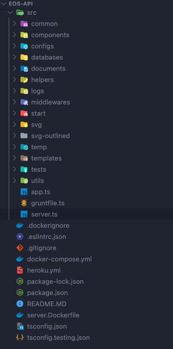

# GSOC-2021-Project-Report-
Final report for my Google Summer of Code project with Python Software Foundation.

## Enhancing the backend beind EOS-icons and introducing new features

### Project Summary

#### What was the initial goal?

Previously the API was in charge of generating new icons sets, customizing SVGs and PNGs.
We wanted to extend the functionality by adding new features like generating SVG code-snippets, base64 encoded images, allow users to recommend a new tags or categories for an icon, cache requests for better performance while serving custom versions of icons, and most importantly unifying our micro-services in a single REST API that will take care of custom icon pack generator, icon information (tags, description, etc.) and potentially filtering/searching.

#### What changes made to the system?

#### Main changes: 

- The code got refactored/re-written in `typescript`.
- The system is now depending on the database as main source of truth. 
- Caching layer is introduced to make the process of fetching the icons faster.
- Algolia services is introduced to be used for the search queries. 
- A validation layer using `Joi` is added to validate all the incoming requests. 
- A unit tests using `Mocha` and `Chai` are written to ensure that all the new APIs are working as expected. 
- A `Docker` image is created to encapsulate everything for easier running and deployment process. 

#### Main funcatonality changes: 

- A single API will respond with the requested icons as string, it can be either `svg` or `base64`. 
- A single API will respond with the requested icons as files, it can be either `png`, or `svg`. 
- A single API will respond with the the requested icons icons as Fonts.
- An API is added to let the user suggest either `tags` or `categories` to any icon. 

#### Non-funcatonality changes: 

- Added A logger to log everything in a more effiecent way, to help us in debugging and fixing issues.
- Added some utilities to handle the errors across the server and the APIs. 
- Added `swagger` documintation for the APIs.
- Re-organized the code in a more modular way, for solid and easier development process. 

### More details about the projects: 

You can find in-depth details about the project from the proposal
[EOS-icons - Backend Proposal](https://blogs.python-gsoc.org/media/proposals/EOS_-_Fawzi_Abdulfattah_-_eos-icons_api.pdf)

I have also written blogs every week to share my GSoC work, the problems I faced and how I overcame all obstacles.

[GSoC Technical Blogs](https://blogs.python-gsoc.org/en/iifawzi_s-blog/) 

### Technologies involved

  `Typescript`, `javascript`, `Node.js`, `Docker`, `MongoDB`, `Redis`, `Algolia`, `Mocha`, `Gitlab hooks`, `Github workflows`.
  
### My code contributions
  I've just listed the main changes, you can find all the changes that I've added to the system from the Pull Requests: 
- [Pull requests by @iifawzi](https://github.com/EOS-uiux-Solutions/eos-icons-api/pulls/iifawzi)

### Thank You

Time flew so fast, couldn't imagine that the previous 4 months flew that fast! I've really enjoyed, and learned a lot of stuff from you all, everything is done, couldn't be done without your motivation, guidance, and our great discussions in slack and in the PRs. Thank you will never be enough for this great experience, you were so friendly, welcoming, and supportive since day one. Thank you! 
